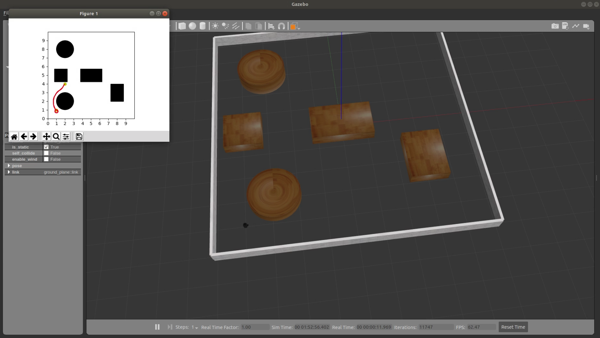
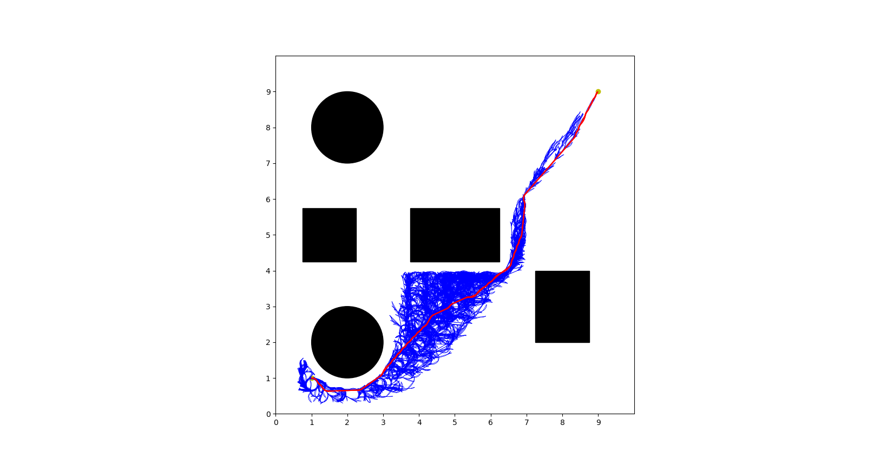
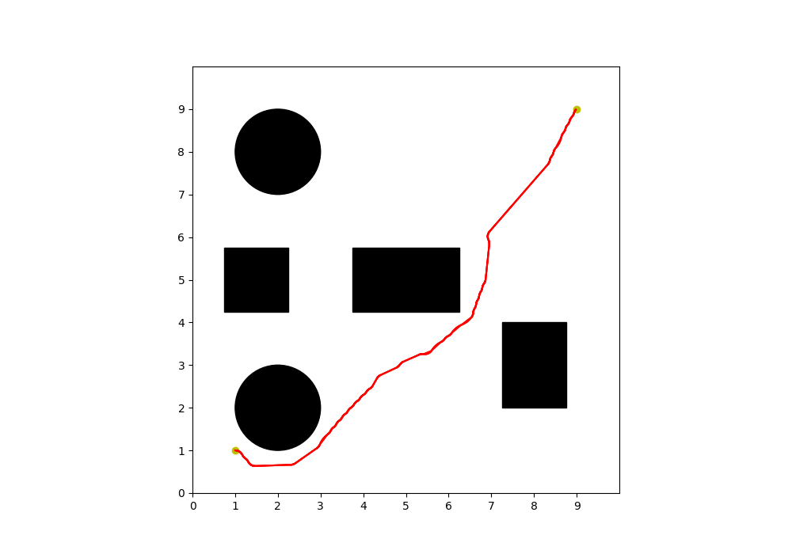

# AStar path planning using ROS 
Implementation of AStar path planning algorithm.
## Requirements and Libraries Used:
- ROS Melodic
- cv2
- python3
- Numpy
- argparse
- matplotlib

## For gazebo simulation using turtlebot3
- First clone some repos
``` bash
mkdir -p <your_workspace>/src
cd <your_workspace>/src
## clone package from github or copy into <your_workspace>/src
git clone https://github.com/ROBOTIS-GIT/turtlebot3_msgs.git
git clone https://github.com/ROBOTIS-GIT/turtlebot3.git
git clone https://github.com/ROBOTIS-GIT/turtlebot3_simulations.git
```
- Build the packages 
``` bash 
cd <your_workspace>
catkin_make
```
- Launch node and world
``` bash
source devel/setup.bash
roslaunch astar_ros_pathplanning astar.launch start:="[1,1,0]" goal:="[2,4,0]" rpm:="[10,10]" clearance:="0.1"
```

## For 2d simulation
- Run the following commands
``` bash
cd astar_ros_pathplanning/src
python3 main.py --start 1 1 0 --goal 3 4 0 --rpm 10 10 --clearance 0.1
```

### Parameters
- start -  Start position of the robot. *Default :- [1 1 0]*
- goal - Goal position of the robot. *Default :- [2 4 0]*
- rpm - Left and Right wheel rpms. *Default :- [10 10]* 
- clearance - Obstacle clearance. *Default :- 0.1*

### Gazebo Simulation
<p align="center">

</p>

### Exploration
<p align="center">

</p>

### Final Backtrack Path example
<p align="center">

</p>
